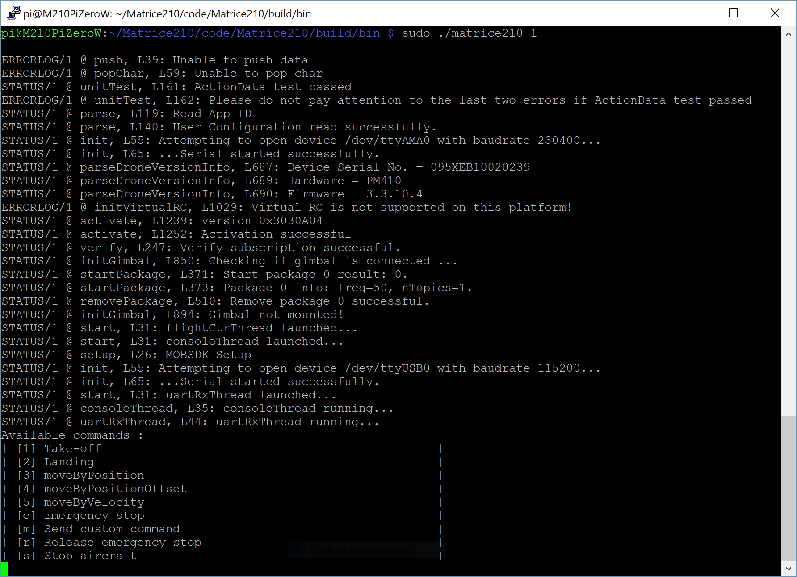
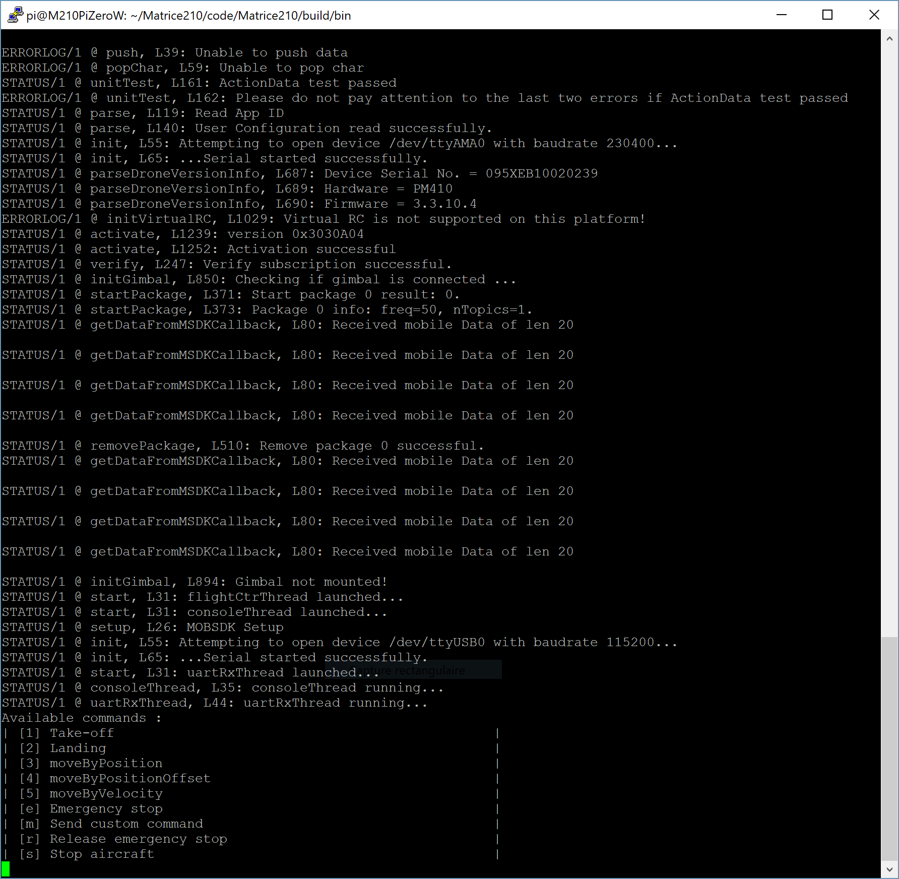

# Matrice210Pi
This code uses [DJI Onboard SDK](https://github.com/dji-sdk/Onboard-SDK/) to communicate with DJI flight controllers. 

## Prerequisites

Code compiled with [CMake](https://cmake.org/) 3.7.2 on a [Raspberry Pi Zero W](https://www.raspberrypi.org/products/raspberry-pi-zero-w/) with [Raspbian Stretch Lite](https://www.raspberrypi.org/downloads/raspbian/) (June 2018 - Kernel version:4.14).

### UART
[DJI Onboard SDK](https://github.com/dji-sdk/Onboard-SDK/) uses serial UART driver to communicate with DJI flight controllers. The UART transmit and receive pins are on GPIO 14 and GPIO 15 respectively, which are pins 8 and 10 on the GPIO header.

In a default install of Raspbian on a Raspberry, the primary UART `/dev/serial0` is assigned to the Linux console. To stop this behaviour, the serial console setting needs to be removed from command line. This can be done using the [raspi-config](https://www.raspberrypi.org/documentation/configuration/raspi-config.md) :

```
sudo raspi-config
```
Select option 5, **Interfacing options**, then option **Serial**, then **Disable serial login shell** (disable linux's use of console uart) and **Enable serial interface**. Exit raspi-config and reboot

### UART by USB
The [32F429IDISCOVERY](https://www.st.com/en/evaluation-tools/32f429idiscovery.html) card used by the embedded sensor transmits values by UART. It is connected to a USB-TTL adaptator and uses USB User port `/dev/ttyUSB0` on the Pi Zero W.

## Install

Clone the [DJI Onboard SDK](https://github.com/dji-sdk/Onboard-SDK/) repository and configure `ONBOARDSDK_SOURCE` in [CMakeList.txt](CMakeLists.txt) depending on your repository location.

In the `Matrice210Pi` root directory, run the following commands to build the app:
```
mkdir build && cd build
cmake ..
make
cd bin
```

You have to copy the `UserConfig.txt` file provided by DJI in the `bin` directory and fill it in with your configuration informations. 
You must register as a developer with DJI and create an OSDK application ID and Key pair, see [here](https://developer.dji.com/onboard-sdk/documentation/development-workflow/environment-setup.html#onboard-sdk-application-registration).

Be sure Onboard SDK is enabled on the aircraft and the baudrate used in `UserConfig.txt` file is the same as defined with DJI Assistant 2, more informations [here](https://developer.dji.com/onboard-sdk/documentation/development-workflow/environment-setup.html).

More informations can be found in the [Quick start Guide](https://developer.dji.com/onboard-sdk/documentation/quick-start/quick-start.html) or in the [DJI documentation](https://developer.dji.com/onboard-sdk/documentation/introduction/homepage.html).

You can then launch program in `bin` directory with
```
sudo ./matrice210 1
```

If the program is launched with `sudo ./matrice210 0`, the console interface is not displayed.

## Result

The following interface is shown in the program console when console is enabled.



Due to the watchdog, if the program is launched after the Android Application on the mobile device, data may be received before full program initialization. 



If console is disabled, `Available commands` are not displayed.

## Linux service

The [runMatrice210.sh](Linux/runMatrice210.sh) script can be automatically launched from a service on Pi start-up if the [matrice210.service](Linux/matrice210.service) is added in `/etc/systemd/system`. Linux service can then be [stopped](Linux/stopMatrice210.sh) and [restarted](Linux/startMatrice210.sh) with dedicated script files 

## Log
The [runMatrice210.sh](Linux/runMatrice210.sh) saves console output in `build/bin/log/` directory. Logs are formatting as follow : `log[index]-[yyyy][mm][dd]-[hh][mm][ss].log`. GMT Date/Time is used, `index` is incremented to have numbered log and last log starts with _ char.

The current log file can be read in real time with command `tail -f _*.log`.

## Usage
For full compatibility, use this code with the [Matrice210AndroidApp](https://github.com/jonathanmichel/Matrice210Android) on an Android device connected to aircraft remote controller and the [Matrice210Stm32](https://github.com/jonathanmichel/Matrice210Stm32) code running on a [STM32F429IDISCOVERY board](https://www.st.com/en/evaluation-tools/32f429idiscovery.html).

## Authors

* **Jonathan Michel** - *Initial work* - [jonathanmichel](https://github.com/jonathanmichel)
